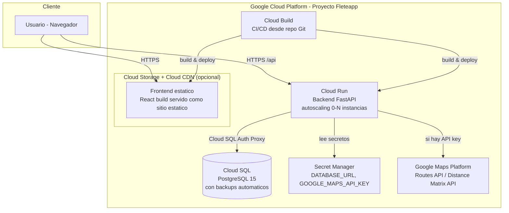

# Arquitectura y Despliegue — Fleteapp

## 1. Recomendacion de proveedor cloud

Se evaluaron AWS, GCP y Azure para este caso de uso: prototipo/PYME que necesita
PostgreSQL gestionado, contenedores para backend/frontend, y probable integracion
futura con Google Maps Platform (Routes API / Distance Matrix API) para reemplazar
el fallback Haversine por distancias/tiempos reales de transito.

### Comparativa

| Criterio | AWS | GCP | Azure |
|---|---|---|---|
| Postgres gestionado | RDS for PostgreSQL (maduro, robusto) | Cloud SQL for PostgreSQL (muy similar a RDS) | Azure Database for PostgreSQL |
| Contenedores serverless (pagar por uso, sin gestionar servidores) | App Runner / Fargate (mas piezas que ensamblar) | **Cloud Run** (el mas simple: despliega un contenedor y listo, escala a cero) | Container Apps (comparable a Cloud Run, algo mas joven) |
| Costo estimado prototipo/PYME (bajo trafico) | Medio — Fargate + RDS con NAT Gateway puede encarecerse rapido | **Bajo** — Cloud Run escala a cero (no cobra si no hay trafico) + Cloud SQL tier pequeno | Medio — similar a AWS |
| Integracion nativa con Google Maps Platform | Requiere API key externa igual en cualquier proveedor, pero sin sinergia de facturacion/IAM | **Sinergia directa**: mismo proyecto GCP, misma cuenta de facturacion, IAM unificado para habilitar Routes API / Distance Matrix API | Requiere API key externa igual que AWS |
| Curva de aprendizaje / simplicidad para equipo pequeno | Media-alta (muchos servicios) | **Alta simplicidad** (Cloud Run + Cloud SQL + Cloud Build cubren todo el flujo) | Media |

### Recomendacion: **Google Cloud Platform (GCP)**

Razones concretas para este caso de uso:

1. **Sinergia con Google Maps Platform**: el conector de distancia/tiempo del prototipo
   esta preparado para usar Google Routes API cuando se provea `GOOGLE_MAPS_API_KEY`.
   Al estar en GCP, la API key, el proyecto, la facturacion y el IAM quedan unificados
   en la misma consola — se habilita la API con un clic y no hay que gestionar
   credenciales cruzadas entre proveedores distintos.
2. **Cloud Run** es el servicio mas simple para desplegar contenedores tipo el backend
   FastAPI y el frontend estatico: se sube la imagen (via Cloud Build o `gcloud run deploy`),
   escala automaticamente segun trafico, y **escala a cero** cuando no hay uso — ideal
   para el perfil de costo de un prototipo o una PYME con trafico variable/bajo.
3. **Cloud SQL for PostgreSQL** es equivalente en robustez a RDS, con backups
   automaticos, alta disponibilidad opcional, y conexion simple desde Cloud Run via
   el conector nativo `Cloud SQL Auth Proxy` (sin exponer la base a internet).
4. Costo total de propiedad bajo para un prototipo: Cloud Run free tier + Cloud SQL
   db-f1-micro/db-g1-small son suficientes para validar el producto con usuarios reales
   antes de invertir en infraestructura mas grande.

AWS y Azure siguen siendo opciones validas y tecnicamente equivalentes (RDS/Fargate,
Azure Database/Container Apps) si la empresa ya tiene infraestructura o contratos
existentes en esos proveedores, pero para este caso puntual (fuerte dependencia de
Google Maps) GCP ofrece la menor friccion operativa.

## 2. Arquitectura de despliegue recomendada



### Componentes

- **Frontend**: build estatico de Vite (`npm run build`) servido desde **Cloud Storage
  + Cloud CDN** (mas economico que un contenedor corriendo 24/7) o, alternativamente,
  otro servicio de Cloud Run si se prefiere mantener paridad de despliegue con el backend.
- **Backend**: contenedor FastAPI en **Cloud Run**, conectado a Cloud SQL via el
  conector nativo (sin exponer IP publica de la base de datos).
- **Base de datos**: **Cloud SQL for PostgreSQL**, con backups automaticos diarios y
  la opcion de alta disponibilidad (regional) cuando el trafico lo justifique.
- **Secretos**: `DATABASE_URL` y `GOOGLE_MAPS_API_KEY` gestionados en **Secret Manager**,
  inyectados como variables de entorno en Cloud Run (nunca hardcodeados).
- **CI/CD**: **Cloud Build** disparado por push a la rama principal del repositorio,
  construye las imagenes Docker y despliega automaticamente a Cloud Run.
- **Google Maps Platform**: se habilita la Routes API / Distance Matrix API en el mismo
  proyecto GCP; el backend detecta la presencia de `GOOGLE_MAPS_API_KEY` y la usa
  automaticamente en vez del fallback Haversine (sin cambios de codigo).

## 3. Pasos concretos: de prototipo local a produccion en la nube

1. **Preparar el repositorio**: subir `fleteapp/` a un repositorio Git (GitHub/Cloud
   Source Repositories/GitLab).

2. **Crear el proyecto GCP** y habilitar las APIs necesarias:
   ```
   gcloud services enable run.googleapis.com sqladmin.googleapis.com \
     secretmanager.googleapis.com cloudbuild.googleapis.com \
     routes.googleapis.com
   ```

3. **Crear la instancia de Cloud SQL**:
   ```
   gcloud sql instances create fleteapp-db --database-version=POSTGRES_15 \
     --tier=db-g1-small --region=us-central1
   gcloud sql databases create flete_db --instance=fleteapp-db
   gcloud sql users create flete_user --instance=fleteapp-db --password=<password-seguro>
   ```

4. **Migrar el esquema**: ejecutar `schema.sql` contra la instancia de Cloud SQL (via
   `psql` con Cloud SQL Auth Proxy, o adoptando Alembic para versionar migraciones
   incrementales en produccion — el modelo SQLAlchemy ya esta listo para generar
   migraciones con `alembic revision --autogenerate`).

5. **Guardar secretos en Secret Manager**:
   ```
   echo -n "postgresql://flete_user:PASS@/flete_db?host=/cloudsql/PROJECT:REGION:fleteapp-db" \
     | gcloud secrets create database-url --data-file=-
   echo -n "<tu-google-maps-api-key>" | gcloud secrets create google-maps-api-key --data-file=-
   ```

6. **Construir y desplegar el backend a Cloud Run**:
   ```
   gcloud builds submit backend/ --tag gcr.io/PROJECT/fleteapp-backend
   gcloud run deploy fleteapp-backend --image gcr.io/PROJECT/fleteapp-backend \
     --add-cloudsql-instances PROJECT:REGION:fleteapp-db \
     --set-secrets DATABASE_URL=database-url:latest,GOOGLE_MAPS_API_KEY=google-maps-api-key:latest \
     --region us-central1 --allow-unauthenticated
   ```

7. **Construir y desplegar el frontend**: ajustar `VITE_API_URL` a la URL publica del
   backend en Cloud Run, correr `npm run build`, y subir `dist/` a un bucket de Cloud
   Storage configurado como sitio web estatico (o desplegar como segundo servicio de
   Cloud Run si se prefiere consistencia de despliegue).

8. **Configurar dominio propio y HTTPS**: mapear un dominio via Cloud Run domain
   mappings o un Load Balancer HTTPS con certificado administrado.

9. **Habilitar CI/CD**: conectar el repositorio a Cloud Build con un trigger en la
   rama principal, para que cada merge dispare build + deploy automatico de ambos
   servicios.

10. **Observabilidad**: activar Cloud Logging y Cloud Monitoring (incluidos por
    defecto en Cloud Run) para logs estructurados, alertas de error rate, y dashboards
    de latencia — util para monitorear el uso real de la Routes API (tiene costo por
    llamada) y detectar cuando el fallback Haversine se esta usando en produccion por
    fallas de la API key.

11. **Endurecer seguridad para produccion**: agregar autenticacion (ej. Identity
    Platform / Firebase Auth o OAuth corporativo), reglas de IAM restringidas al
    servicio de Cloud Run, y rotacion periodica de la API key de Google Maps.
