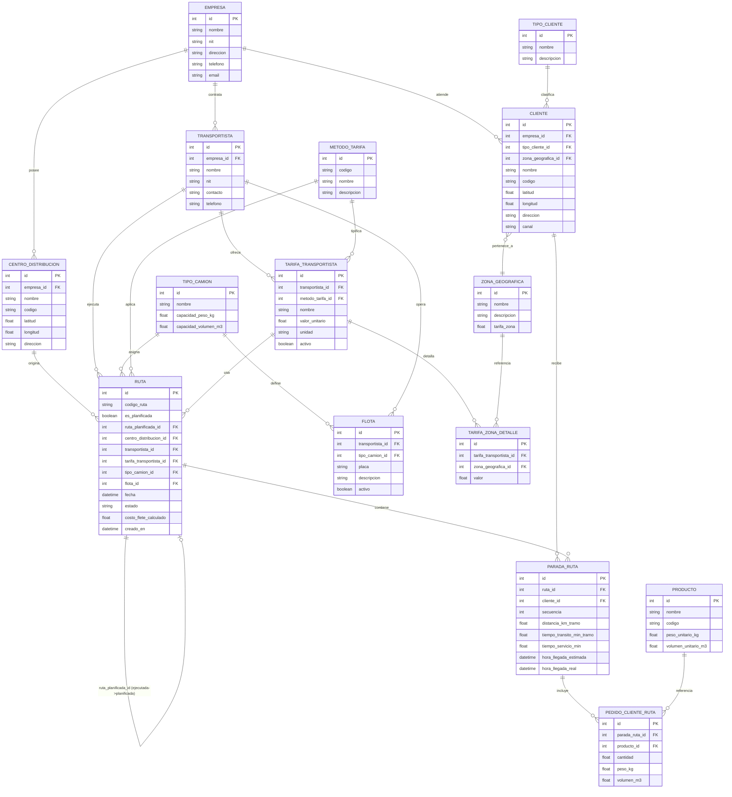

# Modelo de Datos — Sistema de Gestión y Conciliación de Costos de Flete

## Diagrama Entidad-Relación (Mermaid)

## Descripción de tablas

### `empresa`
Datos generales de la compañía dueña de la operación logística. Prototipo soporta una empresa, pero el modelo permite varias.

### `centro_distribucion` (CEDI)
Bodegas/centros desde donde parten las rutas. Guarda `latitud`/`longitud` como floats (WGS84) — sin PostGIS, suficiente para el prototipo.

### `tipo_cliente`
Catálogo de canales (Tradicional, Moderno, Mayorista, Institucional, etc.)

### `cliente`
Puntos de entrega, con geoposición y canal. Cada cliente pertenece a una `zona_geografica` (usada por el método de tarifa "por zona").

### `zona_geografica`
Zonas geográficas comerciales definidas por la empresa/transportista para tarificación. Cada zona tiene una tarifa base (`tarifa_zona`), aunque el valor efectivamente cobrado se parametriza por transportista en `tarifa_zona_detalle` (permite que cada transportista tenga su propia tabla de tarifas por zona).

### `tipo_camion`
Catálogo de tipos de vehículo (ej: NHR, Turbo, Sencillo, Doble Troque) con capacidad de peso y volumen.

### `transportista`
Empresas de transporte externas que prestan el servicio de flete.

### `flota`
Vehículos concretos disponibles, asociados a un transportista y a un tipo de camión.

### `metodo_tarifa`
Catálogo fijo de los 5 métodos de cálculo de flete:
1. `POR_VIAJE`
2. `POR_PARADA`
3. `POR_ZONA`
4. `POR_PESO_VOLUMEN`
5. `POR_TIEMPO_SERVICIO`

### `tarifa_transportista`
Configura, para un transportista y un método de tarifa, el valor unitario aplicable (ej: $/viaje, $/parada, $/kg, $/m3, $/minuto). Un transportista puede tener varias tarifas (una por método que ofrezca). Para el método `POR_PESO_VOLUMEN`, `unidad` indica si es `KG` o `M3`. Para `POR_ZONA`, el valor efectivo viene de `tarifa_zona_detalle`.

### `tarifa_zona_detalle`
Tabla de tarifas específicas por zona para una `tarifa_transportista` de tipo `POR_ZONA`. Permite que cada transportista tenga su propia tabla de precios por zona.

### `producto`
Catálogo de productos con peso y volumen unitario (usado para calcular peso/volumen total entregado en cada parada).

### `ruta`
Registro central de una ruta, ya sea **planificada** (`es_planificada = true`) o **ejecutada** (`es_planificada = false`, con `ruta_planificada_id` apuntando a su ruta planificada de origen, permitiendo la conciliación 1 a 1). Contiene el centro de distribución origen, transportista, tarifa aplicada, tipo de camión/flota asignada, y el costo de flete calculado (cacheado tras el cálculo).

### `parada_ruta`
Secuencia de clientes visitados en una ruta, con distancia y tiempo de tránsito del tramo anterior→esta parada, tiempo de servicio (atención en el cliente), y horas de llegada estimada/real.

### `pedido_cliente_ruta`
Detalle de productos entregados en cada parada, con peso y volumen calculado (cantidad × peso/volumen unitario del producto, o capturado directamente si se desea sobreescribir).

## Reglas de negocio clave

- **Método `POR_ZONA`**: se determina la zona de cada cliente de la ruta, se cruza contra `tarifa_zona_detalle` de la tarifa del transportista asignado, y se toma el **valor máximo** entre todas las paradas. Ese valor máximo es el costo total del viaje (no se suma, no se promedia).
- **Conciliación**: se compara `ruta.costo_flete_calculado` de la ruta planificada vs. su ruta ejecutada asociada (`ruta_planificada_id`), calculando diferencia absoluta y porcentual, tanto por ruta individual como agregado por transportista.
- **Conector de distancia/tiempo**: pluggable — Haversine (con factor de corrección de ~1.3x para simular red vial) por defecto; si `GOOGLE_MAPS_API_KEY` está seteada, se usa Google Routes API (stub preparado, no invocado en el prototipo por defecto).
